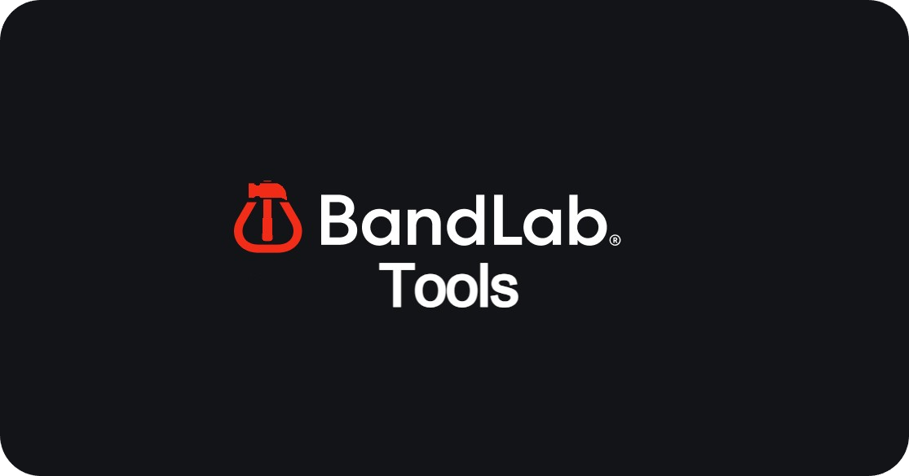

  

## Quick Start

1. **Clone or download** this repository
2. **Navigate to extensions**: `chrome://extensions` (Chrome) or `edge://extensions` (Edge)
3. **Enable Developer mode** in the top right corner
4. **Click "Load unpacked"** and select this folder
5. You're ready to go! Look for the extension icon in your toolbar

## Quick Look

  

### Bypass

Unlock premium content and restricted features:

- **Membership Plan Override** — Unlock all **client-side** membership features
- **Harmony Editor Unlock** — Enable full editing capabilities in Studio's harmony editor

### Privacy

Take control of your data:

- **Block All Analytics** — Disable BandLab's tracking and analytics cookies

### Experimental

Explore cutting-edge features:

- **Sony 360 Reality Audio** — Enable immersive spatial audio playback (when available)

### Settings

Customize your experience:

- **Full Experimentals Mode** — Unlock the full list of BandLab's amplitude experiments for advanced tweaking
- **Auto-Reload Pages** — Automatically refresh BandLab tabs when toggling features
- **Console Logging** — Display interception logs in your browser console for debugging
- **Theme** — Choose from 4 themes (Black Glass, Purple Haze, Midnight Blue, Neon Pink)

## Advanced: Full Experimentals

Enable "Full Experimentals Mode" in Settings to access all amplitude experiments stored in BandLab's localStorage. Each experiment can be:

- Toggled on/off (for boolean flags)
- Modified with custom values (for strings and numbers)
- Real-time tested without UI clicks

Perfect for power users and developers exploring BandLab's feature flags.

---

⚠️ **For educational and personal use only.** Please respect BandLab's terms of service.
